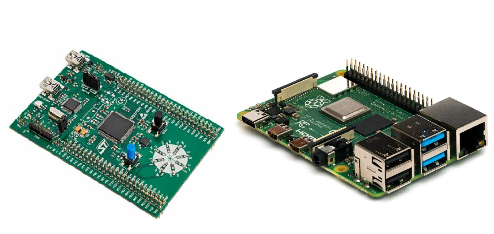

<div id="top"></div>

<!-- PROJECT SHIELDS -->
[![Contributors][contributors-shield]][contributors-url]
[![Issues][issues-shield]][issues-url]
[![MIT License][license-shield]][license-url]
[![Checks Workflow][checks-shield]][checks-url]

<!-- PROJECT LOGO -->
<br />
<div align="center">
  <a href="https://github.com/hmathieu-insat/JammerBox-System">
    
  </a>
  <br />
  <h1>JammerBox Project</h1>
</div>

<!-- TABLE OF CONTENTS -->
<details>
  <summary>Table of Contents</summary>
  <ol>
    <li>
      <a href="#about-the-project">About The Project</a>
      <ul>
        <li><a href="#built-with">Built With</a></li>
      </ul>
    </li>
    <li>
      <a href="#getting-started">Getting Started</a>
      <ul>
        <li><a href="#prerequisites">Prerequisites</a></li>
        <li><a href="#installation">Installation</a></li>
      </ul>
    </li>
    <li><a href="#usage">Usage</a></li>
    <li><a href="#functionalities">Functionalities</a></li>
    <li><a href="#contact">Contact</a></li>
  </ol>
</details>

<!-- ABOUT THE PROJECT -->

# About The Project

<br/>
<div align="center">
  <a href="https://github.com/hmathieu-insat/JammerBox-System">
    
  </a>
</div>
<br/>
<br/>

The JammerBox System consist of a combinaison of a Raspberry Pi 3 and a STM32F303 nucleo board. The system takes as input the Crankshaft and Camshaft signals from the engine's sensors. It provides the user with the possibility to inject various faults into the signals before outputting them. It outputs the signals jammed by the user-choosen faults.

The system should offer the user the possibility to record the input (unjammed) signals as CSV files stored on a USB drive to be later replayed.
The system should also be able to generate signals from previously recorded files.

<p align="right">(<a href="#top">back to top</a>)</p>

# STM32 Hardware programming

## STM32F303 Nucleo Board description

The STM32F030F4 is a 32-bit ARM Cortex-M3 microcontroller with a 32-bit data bus, a 32-bit program counter, and a 32-bit stack pointer. It is a low-cost, low-power, and low-voltage MCU.

It performs the following functions in the JammerBox System:
- CAM SHAFT and CRANK SHAFT input signals processing
- Recording of the input signals
- Jamming of the input signals according to the user-choosen faults

## Built with

- [STM32CubeIDE v1.9.0](https://www.st.com/en/development-tools/stm32cubeide.html#get-software)
- ST-Link GDB server

The project was successfully built and loaded from a Windows 10 and a Windows 11 PC.
</br>
<p align="right">(<a href="#top">back to top</a>)</p>


# Web interface
## Built With

- [React.js](https://reactjs.org/)
- [Bootstrap](https://getbootstrap.com)
- [Node.js](https://jquery.com)

<p align="right">(<a href="#top">back to top</a>)</p>

<!-- GETTING STARTED -->
## Getting Started

### Installation

To clone then install the project, you can use the following commands:

1. Clone the repo
   ```sh
   git clone git@github.com:hmathieu-insat/PIR.git
   ```
2. Get to the repo
   ```sh
   cd /PIR
   ```
3. Configure the project
   ```sh
   chmod u+x Congigure.sh
   ./Configure.sh
   ```
4. A prompt will ask you if you wish to install Powershell (used for some automated tests).


<br/>

<!-- Before running the project, modify the //INSERER NOM DE FICHIER// that is situated in the //DOSSIER // in order to write in the field :

```json
{
  "IP ADRESS": "IP address of the device"
}
``` -->

The web server can finally ran properly in the device with the command:

```sh
chmod u+x Run.sh
./Run.sh
```

<p align="right">(<a href="#top">back to top</a>)</p>

<!-- USAGE EXAMPLES -->

## Usage

Being connected to the same network as the RaspberryPi, type in this link `http://{IP adress of RaspberryPi}:3000/`.

You will land on the starting page of the web site, and from there, you can use all of the functionnalities displayed.
<p align="right">(<a href="#top">back to top</a>)</p>

</br>

<!-- INTERFACE WEB FUNCTIONALITIES -->

# Functionalities

## Inject fault

Allows to inject one of the following faults into the Jammer Box for testing if it detects the fault and reacts accordingly to it.

- CRK SHORT CIRCUIT 
- CAM SHORT CIRCUIT 
- CRK SPK
- CRK RUN OUT
- CRK TOOTH OFF
- CRK GAP NOT DET
- CRK SEG ADP ERR LIM
- CRK PULSE DURATION
- CRK POSN ENG STST
- CAM DELAY
- CAM SPK
- CAM PAT ERR

If a parameter is necessary, another small window will open allowing the introduction of this value and then the start of the jamming. When a parameter is not valid, a pop up window will show informing the user of this. If no parameters are needed, the jamming will start immediately after pressing the corresponding fault button. For either case, when the jamming starts, another pop up window will show up informing the user of the success of the order.

## Faults Injection Logs

Allows to inspect the faults historic logs. Each time a new fault is injected, this page will update and show its characteristics as well as if it was correctly executed. This is done by reading a JSON file that the API updates every time a new fault is injected. In addition, there is a delete button that cleans the faults log when pressed.

Each fault has a replay button, replaying the jammering with the same characteristics as before.


## Configuration

When the “Upload config” button is pressed, a window will open for searching in the user computer a JSON file with the Jammer Box configuration. For example:

```JSON
{
  "NumOfTeeth": 60,
  "NumOfGap": 1,
  "NumOfTeethInGap": 2,
  "Tdc0": 87.75,
  "FirstErSegAngle": 42,
  "NumOfCylinder": 4,
  "CrkSensorType": "c",
  "Cam0NumOfEdges": 2,
  "Cam0Active_edge": "b",
  "Cam0SensorType": "c",
  "Cam0FilterInMicroSec": 30,
  "Cam0EdgePos": 0.333
}
```


Once this file is uploaded, the user can choose to configure the CAM or the CRK separately. With the reset button, either one of these configurations can be erased.

## Start recording

When pressed, it starts recording and saving in file the signals from the Jammer Box for further analysis.

<p align="right">(<a href="#top">back to top</a>)</p>

<!-- CONTACT -->

# Contact

- Aubut, Guillaume - aubut@insa-toulouse.fr
- Mancinelli, Alejo - mancinel@insa-toulouse.fr
- Mathieu, Hugo - hmathieu@insa-toulouse.fr
- Mouton, Viktor Adrian - vmouton@insa-toulouse.fr
- Omre, Erik Semb - omre@insa-toulouse.fr
- Pastor, Emmanuel - e_pastor@insa-toulouse.fr
- Sixt, Romain - sixt@insa-toulouse.fr

Repository Link: [https://github.com/hmathieu-insat/PIR](https://github.com/hmathieu-insat/PIR)

<p align="right">(<a href="#top">back to top</a>)</p>

<!-- MARKDOWN LINKS & IMAGES -->
<!-- https://www.markdownguide.org/basic-syntax/#reference-style-links -->
[contributors-shield]: https://img.shields.io/github/contributors/hmathieu-insat/PIR
[contributors-url]: https://github.com/hmathieu-insat/PIR/graphs/contributors
[issues-shield]: https://img.shields.io/github/issues/hmathieu-insat/PIR
[issues-url]: https://github.com/hmathieu-insat/PIR/issues
[license-shield]: https://img.shields.io/github/license/hmathieu-insat/PIR
[license-url]: https://github.com/hmathieu-insat/PIR/blob/master/LICENSE
[checks-shield]: https://img.shields.io/github/workflow/status/hmathieu-insat/PIR/Node.js%20CI
[checks-url]: https://github.com/hmathieu-insat/PIR/actions/workflows/auto-link-PRs.yml
[product-screenshot]: images/screenshot.png
[vitesco-banner]: images/banner.png
[vitesco-banner-url]: images/banner.png
